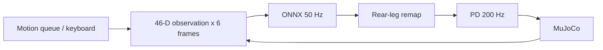

# EE5112 MiniLab 1.3 — Group Report (draft)

**Group index:** [TEAM TO FILL]
**Members and matriculation numbers:** [TEAM TO FILL]
**Submission date:** [TEAM TO FILL]

> Review before submission: fill all identity and contribution fields, replace Task 2 and Task 3 videos as flagged below, and update Task 4 metrics only from the final tested controller revision.

## Contributions and AI usage

| Member | Matriculation number | Actual tasks and contributions |
|---|---|---|
| [Student A] | [ ] | [Review and fill: Task 2 platform, scene, skills, video] |
| [Student B] | [ ] | [Review and fill: Task 3 LLM parser, evaluation, video] |
| [Student C] | [ ] | [Review and fill: Task 4 perception, approach, evaluation, video] |

**AI Usage Declaration (team to verify):** OpenAI Codex assisted with code implementation, debugging, evidence analysis, and drafting parts of this report. [Each member must specify their actual use, review, and ownership before submission.]

# Task 1: Language models and learned quadruped control

The three approaches below place language reasoning above a robot's fast motor controller. Latency and cost for SayCan and Code as Policies are architectural expectations, not measurements from this MiniLab.

| Approach | Core idea and model output | Latency and cost profile | Suitable use |
|---|---|---|---|
| Structured command parsing (our Task 3) | A language model maps an English request to a restricted JSON list of `move`, `turn`, `goto_object`, or `stop` actions. A local schema and numeric validator checks the list before the Task 2 executor acts. | One inference per request, plus action execution. Our 20-utterance planner benchmark measured mean inference latency of 1.096 s for cloud `gpt-4o-mini` and 0.973 s for local `qwen2.5:7b`; the cloud batch cost $0.003601 in total. Local inference had no API fee but uses local compute. These are measurements of this setup, not universal rates. | Bounded navigation and motion requests when a fixed action vocabulary and validation are useful. |
| Affordance-grounded planning (SayCan) | The language model proposes a sequence of known skills; each candidate is combined with an estimated probability that the robot can execute it in the current state. Output is a selected skill sequence, not joint torques. [1] | Evaluating several candidates and updating the plan after skills adds model/affordance work relative to one JSON parse. Cloud inference can incur repeated-call charges; the exact seconds and dollars depend on the model and skill set and were not measured here. | Multi-step household or tabletop tasks with a reusable skill library and changing object availability. |
| LLM-generated robot code (Code as Policies) | The model generates program code that composes perception and robot APIs, allowing conditions, loops, and spatial calculations. Output is code, which must be reviewed or sandboxed before execution. [2] | Code generation takes at least one model call; retries, execution checks, and debugging can add latency and compute cost. We did not benchmark it, so no numeric comparison is claimed. | Flexible manipulation and research prototypes where the fixed JSON vocabulary is too restrictive and generated code can be controlled. |

The quadruped's locomotion policy is obtained by reinforcement learning in simulation for a velocity-command interface, then exported as ONNX and transferred to the MuJoCo simulator; physical deployment would additionally require sim-to-real validation. In our platform, the local policy consumes six frames of 46-dimensional observations and runs at 50 Hz over 200 Hz MuJoCo physics and PD actuation. A roughly one-second LLM response is far too slow to replace either loop. The LLM therefore selects validated high-level actions asynchronously, while Task 2's learned gait and PD loop continue locally. Task 4 similarly uses onboard camera observations for slower search and steering, without giving the LLM direct torque control. [3]

References: [1] Ahn et al., *Do As I Can, Not As I Say: Grounding Language in Robotic Affordances* (2022), https://arxiv.org/abs/2204.01691. [2] Liang et al., *Code as Policies: Language Model Programs for Embodied Control* (2022), https://arxiv.org/abs/2209.07753. [3] Course quadruped platform, https://github.com/aoqianz/quadruped_mujoco, inspected at commit `dd40180f1121a66373d261e64a9a09eb69b1b2a7`; Task 2 control measurements are documented in `task2/Task2_Report.md`. For the JSON implementation, see `task3/action_plan.schema.json`, `task3/validator.py`, and the Task 3 benchmark records.

Task 2: Platform, Scene and Motion Skills

EE5112 MiniLab 1.3 | Semester 1, AY 2026/27

Contributor: Student A - [insert actual name and matriculation number]. This chapter documents Task 2 only; merge it into the group report.

2.1 Platform and control pipeline

The implementation extends the course quadruped_mujoco platform [1] at commit dd40180f1121a66373d261e64a9a09eb69b1b2a7. MuJoCo supplies dynamics; the bundled ONNX locomotion policy runs with CPUExecutionProvider. The original observation construction, rear-leg mapping, action scaling and PD torque equations are retained. A motion queue replaces the keyboard command source during autonomous skills.


Figure 2.1. The local control pipeline. Policy decisions are held for four 5 ms physics steps.

| Observation slice | Content / scale |
| --- | --- |
| 0:3; 3:6; 6:9 | Velocity command x [2,2,0.25]; body angular velocity x 0.25; projected gravity |
| 9:21; 21:33; 33:45 | Joint position deviation; joint velocity x 0.05; previous action |
| 45 | (height command - 0.25) / 0.1 |


Policy joint order is FL, FR, RL, RR, whereas MuJoCo uses FL, FR, RR, RL. Indices [0,1,2,3,4,5,9,10,11,6,7,8] reorder observations and output targets. Without this swap, rear-leg actions are applied to the opposite legs. PD uses Kp=40, Kd=1 and limits of 23.7 Nm (hip/thigh) and 35.55 Nm (calf).


---

2.2 Onboard camera and detectable scene

FrontCamera renders dog_front_camera, rigidly attached to trunk, at 640 x 480 RGB. It samples every 0.1 s of simulation time (20 physics steps). Ten Hz reduces rendering work relative to 200 Hz while providing frequent updates for object search. No wall-clock 10 Hz performance claim is made: slow rendering slows the simulation. latest() returns a locked copy with a simulation timestamp and sequence number.

The custom MJCF contains two chairs and an orange basketball. Chairs are original combinations of a seat, backrest and four legs; the ball has dark seams. External mesh downloads are unnecessary because the complete rendered shapes passed the actual COCO detector test. This does not imply that an arbitrary coloured primitive will be recognised.


Figure 2.2. YOLO11n detections from the live front camera after 2 s of simulation. CPU inference, imgsz=640, confidence threshold=0.25. The RGB array is converted to BGR before NumPy-based YOLO inference.

| Object | COCO class | Centre (x,y,z), m | Confidence |
| --- | --- | --- | --- |
| Green chair | chair | (3, 1, 0.5) | 0.678 |
| Red chair | chair | (3, -1, 0.5) | 0.571 |
| Orange basketball | sports ball | (2.5, 0, 0.16) | 0.408 |


Object centres are recorded in assets/objects.json for distance logging and evaluation only. Task 4 must consume latest() as its sole image source and infer colour from pixels; the class detector alone does not provide colour. Scene labels in this table describe authored objects, not an evaluated colour-grounding algorithm.


---

2.3 Motion API and measured turning error

move(vx, vy, wz, duration) adds a timed command to a thread-safe FIFO queue. Commands are normalised to [-1,1]; they are not guaranteed physical velocities. The control loop checks simulation time, advances the queue in order and returns zero velocity when idle. turn(angle_deg) reads the root quaternion and accumulates wrapped yaw differences, preserving turn direction through the +/-180 degree boundary and supporting turns up to +/-720 degrees.

The turn controller saturates at |wz|=0.65 and uses a minimum nonzero magnitude of 0.40 to overcome the learned gait response dead zone. It stops at an instantaneous yaw error of at most 2 degrees and logs [TURN]. A timeout clears remaining actions and reports FAIL. This is a heading skill; it does not freeze the robot pose or actively hold heading after completion.

For a fair open-loop baseline, a four-second left turn at wz=1 measured a mean rate of 0.651790 rad/s. Each open-loop duration was then |target angle| / calibrated rate. Both methods start after two seconds of settling; the table measures yaw again one second after the command ends. Each condition is one deterministic trial, not a statistical robustness study.

| Method | Target | Measured yaw | Signed error | Time, s |
| --- | --- | --- | --- | --- |
| open | 90 deg | 89.05 deg | 0.95 deg | 2.42 |
| closed | 90 deg | 85.74 deg | 4.26 deg | 5.82 |
| open | 180 deg | 181.24 deg | -1.24 deg | 4.82 |
| closed | 180 deg | 174.88 deg | 5.12 deg | 10.73 |
| open | -90 deg | -111.30 deg | 21.30 deg | 2.42 |
| closed | -90 deg | -83.44 deg | -6.56 deg | 4.68 |


The calibrated open-loop left turns were accurate (0.95 and -1.24 degrees), but reusing that timing for a right turn produced 21.30 degrees error. Direction-dependent gait dynamics invalidate a single universal timing constant. Closed-loop completion errors were 1.92, 1.89 and -1.99 degrees. After one second, errors increased to 4.26, 5.12 and -6.56 degrees because of gait relaxation. Feedback reduced the large right-turn error, but was slower and did not outperform calibrated open loop in every test.

Demo: move(0.5,0,0,3), then turn(180); recorded completion error 1.93 degrees, SUCCESS.


---

2.4 Reproduction, integration and evidence

The tested environment is Linux with Python 3.12, MuJoCo 3.14.0, ONNX Runtime 1.30.0 and Ultralytics 8.4.160. Dependency pins are in requirements-task2.txt; environment-tested.txt records the resolved environment. Install CPU Torch/Torchvision first, then install the repository editable and the Task 2 requirements. The ONNX policy and YOLO11n weights are included.

| Purpose | Command from repository root |
| --- | --- |
| Native / browser | python -m task2.run<br/>MUJOCO_GL=egl python -m task2.run --gui |
| Scene verification | MUJOCO_GL=egl python -m task2.verify_scene |
| Turn comparison | MUJOCO_GL=egl python -m task2.evaluate |
| Unit checks | python -m pytest -q task2/test_skills.py |
| Automated video | MUJOCO_GL=egl python -m task2.run --headless --demo --duration 22 --record evidence/Video_Task2.mp4 |


The original eg/play.py launched successfully in native mode and the browser service ran with --gui. API checks exercised W/S/A/D/Q/E, Race Track, Stairs and Cross Slope, and selected all three onboard cameras. Separate named-camera renders are included. The six unit tests passed, covering queue timing, cancellation, yaw wrapping/full turns, invalid inputs and timeout. Browser skill actions also completed a move and a 180-degree turn (1.87 degrees error).

Task 3 should enqueue actions from its own input/LLM thread while the main simulation thread continuously calls Platform.step(). Task 4 reads FrontCamera.latest(), rejects stale frames and issues short motion commands. Ground-truth object centres are not read by either the motion controller or the camera pipeline. Task 3/4 logic and their evaluation are outside this implementation.

Submission limitation. Video_Task2.mp4 is an offscreen simulation recording with synchronised console text, not a desktop terminal recording. To meet the literal terminal-visible requirement, record the browser/native window beside a terminal, trigger M then K, and retain the [TURN] SUCCESS line. The supplied evidence does not claim that the student has personally performed that recording.

AI Usage Declaration (review before submission). OpenAI Codex assisted with implementation, scene construction, debugging, test execution and drafting this Task 2 chapter. The submitting student must review the code, fill in their identity and actual contribution, and be able to explain the submitted work.

References

[1] Course platform: https://github.com/aoqianz/quadruped_mujoco (commit recorded on page 1).<br/>[2] MuJoCo documentation: https://mujoco.readthedocs.io/<br/>[3] Ultralytics documentation and YOLO11n COCO weights: https://docs.ultralytics.com/<br/>[4] EE5112 MiniLab 1.3, Semester 1 AY2026/27, Task 2 specification.


See evidence/turn_comparison.csv and evidence/detections.json for numerical tables.

# EE5112 MiniLab 1.3 — Task 3 Final Report

## 1. Deliverable summary

Task 3 converts an English terminal command into a validated JSON action plan and executes the
plan through the Task 2 quadruped platform. It also dispatches visual object-navigation actions to
the existing Task 4 controller. The implementation supports two interchangeable LLM providers:
OpenAI `gpt-4o-mini` and local `qwen2.5:7b` through Ollama.

Submitted material includes:

- Task 3 source code, JSON Schema and 102 automated tests;
- Task 2 motion-queue and Task 4 visual-navigation integration;
- a fixed 20-command benchmark for both LLMs;
- per-command latency, token, cost and failure records;
- a 1080p MP4 desktop demonstration and its verification metadata.

No API key, `.env` file, model weight or private credential is stored in Git.

## 2. System architecture

```text
English terminal command
        |
        v
local input policy
        |
        v
OpenAI planner OR Ollama/Qwen planner
        |
        v
JSON/schema validator -> explicit direction guard
        |
        v
sequential PlanExecutor
        |
        +---- move / turn / stop ----> Task2MotionAdapter ----> Task 2 queue
        |
        +---- goto_object -----------> Task4Integration ------> task4.py
                                                              |
                                                    onboard RGB camera only
```

LLM and robot work run in a command worker. The MuJoCo owner thread continuously calls
`platform.step()`, so inference, queue waits and Task 4 navigation never block physics updates.

## 3. Action contract and safety boundary

The model may emit only four action types:

| Action | Important limits |
|---|---|
| `move(vx, vy, wz, duration_s)` | velocities in `[-1, 1]`; duration in `(0, 60]` seconds |
| `turn(angle_deg)` | non-zero angle in `[-720, 720]` degrees |
| `goto_object(class, color)` | supported targets: red or green chair |
| `stop` | must be the only action in its plan |

OpenAI Structured Outputs and Ollama's schema format reduce malformed responses, but neither is
trusted. `validator.py` independently rejects missing/extra fields, wrong types, booleans used as
numbers, NaN/Infinity, duplicate JSON keys, unsafe ranges, empty accepted plans and actions in a
rejected plan.

The final runtime additionally compares explicit one-action direction words with numeric signs:
forward/backward use positive/negative `vx`, left/right translation uses positive/negative `vy`,
and left/right turns use positive/negative angles. A contradiction produces a visible `[GUARD]`
rejection and no motion. This was added after Qwen produced text saying “right” with `vy=+0.2`.

## 4. Terminal, context and execution

The asynchronous chat loop prints stable one-line evidence records:

```text
[INPUT] -> [LLM] -> [CMD] -> [PLAN] -> [EXEC] -> [DONE]
```

`[INPUT]` contains the sanitised user text. The teacher-facing `[CMD]` record contains the parsed
actions and count (for example, `[CMD] actions=move(...),turn(...) n=2`); a single Task 4 target uses
`[CMD] goto_object class=chair color=green`. A rejection uses a stable
reason (`[CMD] rejected reason=unsupported_request`). `[PLAN]` remains additional validation detail
and does not replace `[CMD]`.

Actions execute strictly in list order. A failure or cancellation stops the current action and
skips all remaining actions. Only an accepted plan whose execution ends in `SUCCESS` becomes the
next conversational context. This lets “Do that again, but slower” refer to the last successful
move without allowing a rejected or failed request to poison later commands.

## 5. Task 2 and Task 4 integration

Task 2's `move()` and `turn()` methods enqueue work and return immediately. `Task2MotionAdapter`
turns that interface into blocking worker-side operations by observing queue completion and closed-
loop turn result records. It never advances MuJoCo itself.

`Task4Integration` captures a synchronized onboard-camera, robot-position and simulation-time
snapshot immediately after `platform.step()`. `goto_object()` uses YOLO detections and image-space
feedback to steer. Object truth coordinates are read only after stopping to calculate the final C2
distance; they do not control navigation.

## 6. Two-model benchmark

Both providers received the same 20 independent cases at temperature zero: 10 basic commands,
5 paraphrases and 5 invalid/out-of-range requests. This planner-only benchmark did not move the
robot.

| Provider | Model | Overall | Basic | Paraphrase | Invalid | Mean latency | API cost |
|---|---|---:|---:|---:|---:|---:|---:|
| OpenAI | `gpt-4o-mini` | 15/20 (75%) | 9/10 | 1/5 | 5/5 | 1.096 s | $0.003601 |
| Ollama | `qwen2.5:7b` | 16/20 (80%) | 10/10 | 4/5 | 2/5 | 0.973 s | $0.000000 |

OpenAI was more conservative: it rejected all five invalid requests, but over-rejected safe
paraphrases. Qwen understood more valid wording but was weaker on safety limits. It clipped a
requested speed of 1.5 to 1.0 and emitted out-of-range duration/angle values in two cases. The
local numeric validator blocked the latter two. Qwen also reversed the sign of a rightward
paraphrase; the final direction guard blocks this class of runtime error.

The raw results and all failure records are in `evidence/step13_benchmark_results.json` and
`evidence/step13_benchmark.md`. The benchmark predates the direction guard deliberately: the table
measures each LLM's own understanding rather than post-processing accuracy.

## 7. Verification

Run all Task 3 tests from the repository root:

```bash
conda run -n ee5112-minilab python -m pytest -q task3
```

Current main-aligned result during the log-protocol revision:

```text
115 passed, 3 failed
```

The tests cover parsing, schema and semantic limits, direction consistency, provider boundaries,
context, cancellation, strict execution order, Task 2 completion, Task 4 callbacks, log sanitising,
benchmark scoring and cost calculations. All 40 log/chat/policy/executor tests pass. The three
remaining failures are inherited Task 4 final-redetection test mismatches and are tracked
separately from this logging change.

## 8. Reproduction

The final local verification environment used Python 3.12.14, MuJoCo 3.14.0, NumPy 2.5.3,
Ultralytics 8.4.160, OpenAI Python 3.20.0 and Ollama 0.34.4. Task 3 pins only the additional
Python dependency it introduces; simulator and vision packages come from the Task 2 environment.

Install the Task 3 Python dependency in the existing Task 2 environment:

```bash
python -m pip install -r task3/requirements-task3.txt
```

For OpenAI:

```bash
export OPENAI_API_KEY="..."  # set locally; never commit it
python -m task3.run --provider openai --model gpt-4o-mini \
  --task2-root /path/to/task2-project --gui
```

For local Qwen:

```bash
ollama serve
ollama pull qwen2.5:7b       # first use only
python -m task3.run --provider ollama --model qwen2.5:7b \
  --task2-root /path/to/task2-project --gui
```

Enter `/quit` to cancel outstanding work and stop the integrated runtime safely.

## 9. Video evidence

The previous desktop recording predates the corrected `[INPUT]`/`[CMD]` protocol and must be
re-recorded after the remaining improvements are complete. The replacement must visibly show
parsed-action and rejected `[CMD]` records, plus one English request parsed as
`[CMD] actions=move(...),turn(...) n=2` with both execution steps completing in order. Both
providers are evaluated with the common benchmark, so only one integrated provider demonstration
is needed.

- File: `EE5112_MiniLab1_3_Task3_Demo.mp4`
- Format: H.264 MP4, 1920x1080, 30 FPS, 95.8 seconds
- SHA-256: `60286cd75e30b259b027c979f05546675a1a5cb6f65f1b407d9fe5bb06c28d0c`

The MP4 is uploaded separately to the course submission system. It is not committed to the source
repository. Recording commands and acceptance checks are in `evidence/step15_video_script.md`.

## 10. Known limitations

- The explicit direction guard intentionally handles only unambiguous single-action commands;
  arbitrary multi-clause semantic equivalence remains an LLM/evaluation problem.
- A schema-valid model may still alter a requested magnitude, as Qwen did for speed 1.5. Runtime
  limits prevent unsafe values, but complete intent equivalence requires broader semantic checks.
- Local Qwen has no API fee but requires Ollama, model storage and suitable local compute.
- Visual navigation depends on onboard-camera visibility and detector quality; scene truth is not
  a fallback steering signal.

## 11. Evidence index

- `evidence/step10_pure_motion.md` — live movement and sequential-action checks
- `evidence/step11_task4_integration.md` — camera-only Task 4 integration
- `evidence/step12_local_qwen.md` — local provider setup and end-to-end run
- `evidence/step13_benchmark.md` — two-provider comparison and failure analysis
- `evidence/step13_benchmark_results.json` — machine-readable benchmark records
- `evidence/step14_tests_logs.md` — automated coverage and log contract
- `evidence/step15_video_script.md` — final video commands and technical verification

# Task 4: YOLO object search and approach

## Method and integration

We used the Task 2 `object_lab` MJCF scene
(`task2/task2/assets/scene.xml` in this repository) and its quadruped locomotion skills.
The controller reads only the robot's onboard `dog_front_camera` RGB frames
(640 × 480, sampled at 10 Hz of simulation time). The shared camera has a
100° vertical field of view in both the Task 4 trial runner and the Task 3
interactive entry point. The browser display uses a rear overhead camera to
show the dog and objects; it does not feed the controller.

CPU YOLO11n supplies COCO class labels and bounding boxes at confidence ≥0.25.
For each box we convert its pixels to HSV, ignore pixels with saturation <70
or value <25, and label red or green when at least 35% of the remaining pixels
fall in the corresponding hue range (Pillow hue 0–255: red 0–14 or 242–255;
green 50–128). This simple class-plus-color rule suits the two same-class
chairs in our scene without a separate color model. It can fail when the chair
is heavily cropped, partially occluded, or affected by body pitch.

Task 3 parses the typed English command into a validated
`goto_object(class="chair", color="red"|"green")` action. The Task 4 callback
requests synchronized fresh camera/robot-pose snapshots from the Task 2
adapter. Before acquiring a target, two consecutive camera misses trigger a 30°
search turn; while tracking a target, five consecutive misses are tolerated before
resuming the search. After detection, the controller makes a partial turn toward
the box center and advances through completed 0.25 s motion skills. Close-range
box width limits the final number of short steps. It then stops and checks up to
three fresh frames. If an extremely close chair is cropped out, the only recovery
is one short backward step followed by another stop and fresh-frame check; it never
turns during final recovery. A full search turn without a target, timeout, lost
stopped-frame target after recovery, or excessive final distance prints
`[MISSION] status=FAIL reason=...`.
The mission wall-clock timeout is 120 s in the fixed evaluation; the GUI
demonstrations allow 180 s.

The robot first stops, then checks the target class **and** color on a fresh
onboard frame (C1). Only then does it read the Task 2 object center to compute
trunk-to-object planar distance and enforce d ≤0.80 m (C2). It prints one
`[FOUND] class=... color=... t=... d=...` line only after C1 and C2 pass (C3).
Object coordinates never steer the robot. The simulator's object-contact
records are checked after each trial.

## Fixed evaluation

The results below belong to controller revision `2fa2821`, which includes
close-range re-observation and collision-safe final recovery. The optional
randomized-start poses are explored separately from this fixed batch.

All ten trials used controller commit `2fa2821`, one scene, one detector and
one parameter set. We varied requested color and robot start position/yaw;
180° starts deliberately face away from the target. These are structured
target trials that isolate navigation; the separate video verifies the real
English LLM-to-simulator path. The table's `d_eval` is the independent
post-mission snapshot distance in meters. C2 is decided from the live stopped
snapshot in each mission log, so a small difference between the two distances
does not change the verdict.

| Trial | Target | Start (x, y, yaw°) | Initial target detection | C1 class + color | d_eval (m) | Result |
|---|---|---|---|---|---:|---|
| 01 | green chair | (1, 1, 0) | yes | yes | 0.760 | success |
| 02 | red chair | (1, −1, 0) | yes | yes | 0.751 | success |
| 03 | green chair | (0.5, 1, 0) | yes | yes | 0.827 | fail: stopped C2 d = 0.8276 m |
| 04 | red chair | (0.5, −1, 0) | yes | yes | 0.832 | fail: stopped C2 d = 0.8314 m |
| 05 | green chair | (0, 0, 0) | no | yes | 0.756 | success |
| 06 | red chair | (0, 0, 0) | yes | yes | 0.808 | fail: stopped C2 d = 0.8079 m |
| 07 | green chair | (1, 1, 180) | no | yes | 0.768 | success, initially hidden |
| 08 | red chair | (1, −1, 180) | no | yes | 0.818 | fail: stopped C2 d = 0.8170 m |
| 09 | green chair | (1, 0, 30) | no | **no** | 0.484 | fail: Task 2 turn timeout |
| 10 | red chair | (1, 0, −30) | no | **no** | 2.221 | fail: full turn without detection |

The stopped-frame target detection rate is **8/10 (80%)**. Grounding selected
the requested color on **8/8** stops with a target detection, or **8/10 (80%)**
of all trials. The full C1–C3 approach success rate is **4/10 (40%)**, with
**0/10 object-contact trials**. This detection rate is a task-level stopped
frame measure, not conventional mAP; we did not annotate every frame with
ground-truth boxes. Five starts had no initial target detection, including
the two 180° hidden starts. Trials 03, 04, 06 and 08 selected the correct chair
but stopped 0.0276 m, 0.0314 m, 0.0079 m and 0.0170 m outside C2, respectively.
Trial 09 reached a close final evaluation pose but a Task 2 turn timeout ended
the mission before a stopped-frame target confirmation. Trial 10 completed a
full search turn without detecting the requested red chair. None is counted as
found, and no result from an earlier controller revision is mixed into this rate.

The compact GitHub evidence is in
[`task4_evidence/2026-10-02-benchmark-2fa2821/`](task4_evidence/2026-10-02-benchmark-2fa2821/):
`manifest.json`, per-trial logs and `result.json`, `summary.csv` and
`summary.json`. Raw RGB frames and annotated detections remain local, outside
Git. Earlier batches remain historical and are not combined with this fixed
evaluation.

## Video and reproduction

The historical `Video_Task4.mp4` is stored locally, not on GitHub. It is a
104.375 s, 1920 × 1080, 8 fps desktop recording. The terminal remains visible
throughout both unaltered executions. It was recorded before revision
`2fa2821`, so its two missions are demonstration evidence, not entries in the
current ten-trial rate. The first command is `Go to the red
chair.` from a 180° start; it shows `[CMD]`, `[SEARCH]`, `[DETECT]`, `[FOUND]
... d=0.74 m`, and `[MISSION] status=SUCCESS`. The second is `Go to the green
chair.`; both red and green chair detections occur in that live log, and it
ends with `[FOUND] ... d=0.75 m` and `[MISSION] status=SUCCESS`. The video uses
the real Task 3 chat loop and DeepSeek `deepseek-chat` JSON planner; the API
key is read from `DEEPSEEK_API_KEY` in the environment and is not in the repo.
Task 3's separate report covers its OpenAI-versus-local-Qwen comparison.
The two original terminal logs and the MP4 hash are retained locally.
Separate historical headless logs in
[`task4_evidence/2026-09-30-llm-current/`](task4_evidence/2026-09-30-llm-current/)
show real DeepSeek English commands succeeding for aligned red and green chairs
at 0.79 m each. The same folder also retains a random-start red-chair run that
correctly failed C2 at 0.8011 m. These logs verify that revision's LLM integration
but are not substitutes for the terminal-visible video.

On Windows, use the checked-in `task2/` source. Install Task 2 and Task 3
requirements under Python 3.12, then run from this repo:

```powershell
py -3.12 -m venv .venv
.\.venv\Scripts\python.exe -m pip install torch torchvision --index-url https://download.pytorch.org/whl/cpu
.\.venv\Scripts\python.exe -m pip install -e .\task2
.\.venv\Scripts\python.exe -m pip install -r .\task2\requirements-task2.txt -r task3\requirements-task3.txt pywin32
.\.venv\Scripts\python.exe -u run_task4_benchmark.py runs\new_fixed_batch
.\.venv\Scripts\python.exe summarize_task4_benchmark.py runs\new_fixed_batch
.\capture_task4_demo.ps1 -Color red -RunId red_new
.\capture_task4_demo.ps1 -Color green -RunId green_new
```

The measured Windows environment was Python 3.12.7, MuJoCo 3.14.0,
NumPy 2.5.2, ONNX Runtime 1.30.0, Ultralytics 8.3.111,
PyTorch 2.6.0+cpu and Pillow 10.4.0. The packaged Task 2 requirements may
install newer patch versions on another machine, so rerun the fixed batch
there before comparing outcomes.

The benchmark runs headlessly with structured targets; the capture scripts
open the live browser at <http://127.0.0.1:8765> and an interactive terminal.
They require a configured `DEEPSEEK_API_KEY`, Windows desktop access, and the
video helper packages `imageio-ffmpeg` and `pywin32`. A human can instead run
`run_task4_demo.ps1` and type the English command in its terminal. The final
video concatenates the two successful desktop clips in red-then-green order
without changing either execution.


# Task 5: Integration and submission

The scene, onboard camera, Task 2 motion skills, Task 3 structured command interface and Task 4 visual approach are connected by `task3/run.py`. The Python and platform version, dependencies, install commands, scene paths, LLM key handling, and reproducibility commands are specified in the Task 2–4 sections and the root README. The two-model Task 3 table and ten-trial Task 4 table above are from their cited raw records. Object-center coordinates are used only after the robot stops, to evaluate the 0.80 m Task 4 distance condition.

**Video status before final export:** The existing Task 4 desktop video shows successful red and green chair searches with the terminal. The existing Task 2 video needs a desktop recording with the real `[TURN]` line visible. The existing Task 3 desktop video needs a single multi-step English command with at least two executed actions including a turn; it already shows a rejected command. Replace those files in the final package and review them end to end.

**Final group package:** `minilab_1.3_group_<index>.zip` must contain this report as PDF, source and setup instructions, Task 2 scene/objects and model dependencies, prompt/schema files, and `Video_Task2.mp4`, `Video_Task3.mp4`, `Video_Task4.mp4`. Group index and identity fields remain pending team confirmation.
