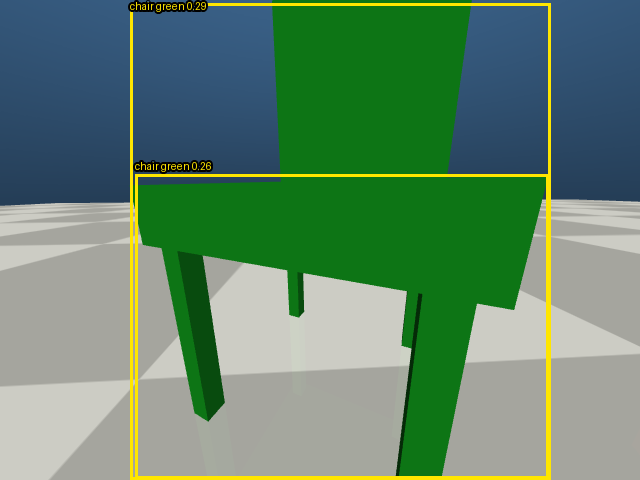
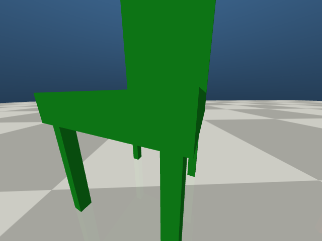

# Command Your Robot Dog

## EE5112 MiniLab 1.3 - Group Report

**National University of Singapore | Semester 1, AY 2026/27**

**Group index:** [TEAM TO FILL]<br/>
**Submission date:** [TEAM TO FILL]

| Member | Matriculation number | Actual contribution (confirm before submission) |
| --- | --- | --- |
| [Student A] | [TEAM TO FILL] | [Review and fill: Task 2 platform, camera, scene, skills and video] |
| [Student B] | [TEAM TO FILL] | [Review and fill: Task 3 parser and evaluation; Task 1 research; optimisation and bonus] |
| [Student C] | [TEAM TO FILL] | [Review and fill: Task 4 perception and navigation; integration, evaluation and group report] |

**AI Usage Declaration.** OpenAI Codex assisted with implementation, debugging, experiment analysis, repository integration and report drafting. [Each member must specify their actual tools and use, review the declaration and source files, and confirm ownership.] The team is responsible for understanding the submitted code, checking numerical claims against saved records and reviewing the demonstrations.

**Abstract.** We built a simulated quadruped that converts English instructions into validated actions and executes them on a shared MuJoCo platform. A pretrained ONNX walking policy handles locomotion, an asynchronous language model selects high-level actions, and onboard RGB images guide object search and approach. Our scene contains green and red chairs and an orange sports ball. The parser comparison used twenty common test utterances with OpenAI and local Qwen; navigation was evaluated with ten fixed target/start combinations. Optional extensions add local English speech transcription and ordered multi-goal missions. This report explains the architecture, measurements, failure cases and submission procedure, distinguishing parser accuracy, navigation results, contract checks and demonstration evidence.

> Review copy: identity, contribution and AI-use fields require team confirmation. Final media acceptance is recorded in `TASK5_REVIEW.md`.

<div class="pagebreak"></div>

# 1. Objective and system integration

The complete interaction loop is English command, structured LLM plan, local validation, autonomous execution, perception and completion or failure. Tasks 3 and 4 use the exact platform, scene, onboard camera and skills created in Task 2. After ENTER there is no second start trigger or operator steering [1].

| Task | Our work in the complete system |
| --- | --- |
| 1: research | Compare language-to-robot interfaces; explain learned locomotion and the separation of planning and control. |
| 2: platform | Adapt the quadruped, create a detectable scene, expose fresh RGB frames and implement timed moves and feedback turns. |
| 3: language | Parse English into ordered JSON actions, validate them, retain successful-plan context and compare two LLM services. |
| 4: navigation | Ground class and colour, search when absent, align and approach from images, then enforce the found criteria. |
| 5: group delivery | Integrate source and evidence into one report, provide reproducible commands and package the report, scene, prompts and local videos. |

<div class="pipeline">English text or optional speech &rarr; LLM JSON plan &rarr; validator &rarr; executor<br/>Timed move / feedback turn &harr; onboard detection and search<br/>ONNX policy (50 Hz) &rarr; PD actuation and MuJoCo physics (200 Hz)<br/>Fresh stopped image + evaluation-only distance &rarr; [FOUND] / [MISSION]</div>

The main thread owns physics. Terminal input and inference run outside it, so waiting for a human or network response cannot suspend the walking loop. Worker-side adapters wait for each queued skill to complete without advancing MuJoCo themselves. Camera snapshots consistently pair RGB, simulation time and trunk XY. The rear overhead camera is for viewing; only `dog_front_camera` supplies navigation images.

# 2. Task 1: language models and learned locomotion

## 2.1 Comparing language interfaces

The teammate's Task 1 study discusses structured parsing, layered planning and affordance-based reasoning. We incorporate that distinction and explicitly compare the named methods required by the brief. Layering describes our architecture rather than a separate output format. SayCan and Code as Policies were not implemented or benchmarked here; their latency and cost descriptions are architectural expectations.

| Approach | Core idea and model output | Latency and cost profile | Suitable setting |
| --- | --- | --- | --- |
| Structured parsing | An utterance becomes JSON or function arguments for fixed robot skills, checked before execution [7]. | One inference per request. Our parser-only means were 1.096 s cloud and 0.973 s local; estimated cloud cost was $0.00018006/call. | Bounded motion and indoor navigation with inspectable actions and numeric limits. |
| SayCan | Language relevance is combined with skill value functions estimating physical feasibility. Output selects known skills [4]. | Candidate scoring and replanning add language and affordance computation; repeated cloud inference may add fees. Not measured here. | Long household tasks with reusable skills and changing feasibility. |
| Code as Policies | The model generates programs composing perception and robot APIs, including loops, conditions and spatial calculations [5]. | Generation, recursive helpers and validation may require multiple calls. Execution cost depends on the program. | Flexible manipulation and research tasks needing richer logic than a fixed action list. |

Structured parsing gives this project a small inspectable action boundary while supporting ordered plans. Schema adherence does not guarantee intent equivalence: Qwen's measured direction error shows why semantic checks remain necessary. SayCan would need task-specific feasibility estimators; generated code would need further execution controls. Neither is required for our small fixed skill set.

## 2.2 Learned locomotion and the two-rate architecture

A typical quadruped walking policy is learned in simulation through reinforcement learning with a velocity-command interface. Rewards encourage tracking and stable posture, while penalties discourage undesirable contacts and excessive actuation. Parallel simulation and curricula can accelerate training; Rudin et al. provide an example [6]. Domain randomisation and calibration support transfer, but simulation results alone do not establish physical-robot safety.

We use the course's existing ONNX policy and do not train a new one. Its original training recipe is not inferred from the exported network. The policy receives commands and robot state and produces joint position targets. Sim-to-sim transfer requires matching observations, joint order, action scale and timing; sim-to-real would additionally require hardware, sensing and delay calibration, outside this MiniLab.

The policy runs at 50 Hz over a 200 Hz MuJoCo and PD loop [2]. A roughly one-second language response cannot supply 20 ms policy or 5 ms physics updates. The LLM therefore selects high-level actions when a command arrives, while local perception and motion continue. This is the two-rate design: slow language planning above fast feedback control, with camera sampling at its own lower rate.

# 3. Task 2: platform, camera, scene and skills

## 3.1 Platform adaptation

We extended `quadruped_mujoco` at upstream revision `dd40180f1121a66373d261e64a9a09eb69b1b2a7` [2]. MuJoCo supplies dynamics [3]; ONNX Runtime executes the walking policy on CPU. Six successive 46-dimensional observations contain commands, angular velocity, projected gravity, joint deviations and velocities, previous actions and body-height command. Policy outputs are held for four physics steps.

The policy order is FL, FR, RL, RR, whereas MuJoCo uses FL, FR, RR, RL. Mapping `[0,1,2,3,4,5,9,10,11,6,7,8]` keeps observations and targets consistent. We retained the upstream observation and action scales and PD equations. Nominal gains are Kp = 40 and Kd = 1, with hip/thigh limits of 23.7 Nm and calf limits of 35.55 Nm. A motion queue replaces keyboard commands during autonomous skills while preserving locomotion.

<div class="pipeline">Velocity commands (vx, vy, wz) and body height &rarr; 46-D observation x 6 frames<br/>ONNX policy at 50 Hz (decimation 4) &rarr; rear-leg target remap<br/>Joint targets &rarr; PD torques at 200 Hz &rarr; MuJoCo &rarr; state feedback</div>

The Task 2 development report records native/browser launches, W/S/A/D/Q/E control, Race Track, Stairs and Cross Slope checks, and all three onboard cameras. These UI checks are historical development evidence and were not repeated during this report review.

## 3.2 Camera and authored scene

The trunk-mounted camera exposes copied 640 x 480 RGB frames with timestamps and sequence numbers every 0.1 s of simulation time, or twenty physics steps. Ten Hz avoids rendering at 200 Hz and suits short motion commands. It is a simulation-time rate, not a claim of ten wall-clock inferences per second. Task 4 uses a 100-degree vertical field of view.

The custom MJCF at `task2/task2/assets/scene.xml` has three procedural objects from two COCO classes [9]. Seat, backrest and leg geometry makes the chairs recognisable; arbitrary coloured boxes are not assumed detectable. The basketball includes dark seams. Centres in `task2/task2/assets/objects.json` are used only for final distance logging.

| Object | COCO class | Centre (x, y, z), m | Task 2 detection confidence |
| --- | --- | --- | ---: |
| Green chair | chair | (3, 1, 0.50) | 0.678 |
| Red chair | chair | (3, -1, 0.50) | 0.571 |
| Orange basketball | sports ball | (2.5, 0, 0.16) | 0.408 |

<div class="figure"><p><em>Figure 1. Task 2 front-camera verification after two simulation seconds. CPU YOLO11n, image size 640, confidence threshold 0.25; RGB is converted to BGR for NumPy-based inference. Class detections establish scene detectability, not Task 4 colour-grounding accuracy.</em></p></div>

## 3.3 Motion API and turning experiment

`move(vx, vy, wz, duration_s)` queues normalised commands in [-1, 1], not guaranteed physical velocities. `turn(angle_deg)` reads the root quaternion and accumulates wrapped yaw increments, preserving direction across +/-180 degrees and supporting up to +/-720 degrees. Feedback uses a saturated yaw command and minimum active magnitude to overcome the gait dead zone. It stops at an instantaneous error of at most two degrees; timeout clears the queue and reports failure.

For the timing baseline, a four-second left turn at wz = 1 calibrated a rate of 0.651790 rad/s. Baseline durations were absolute target angles divided by this rate. Both methods settled two seconds before moving; the table measures yaw one second after completion. Each condition is one deterministic trial, not a robustness study.

| Method | Target, deg | Settled yaw, deg | Signed error, deg | Command time, s |
| --- | ---: | ---: | ---: | ---: |
| Open loop | 90 | 89.05 | 0.95 | 2.42 |
| Closed loop | 90 | 85.74 | 4.26 | 5.82 |
| Open loop | 180 | 181.24 | -1.24 | 4.82 |
| Closed loop | 180 | 174.88 | 5.12 | 10.73 |
| Open loop | -90 | -111.30 | 21.30 | 2.42 |
| Closed loop | -90 | -83.44 | -6.56 | 4.68 |

Calibrated left turns were accurate, but reusing their rate for a right turn caused a 21.30-degree error. Feedback completion errors were 1.92, 1.89 and -1.99 degrees; gait relaxation increased the later settled errors. Feedback reduced the large right-turn error, but was slower and did not outperform the calibrated baseline in every condition. Measurements are in `task2/evidence/turn_comparison.csv`.

# 4. Task 3: English planning and autonomous execution

## 4.1 Structured output and safety boundary

The parser receives the action schema and task prompt. OpenAI uses strict JSON-schema output through the Responses API; Ollama receives the schema as its structured format. DeepSeek and DashScope use compatible JSON-object mode with independent validation. JSON mode controls syntax; strict structured output additionally constrains supported schema structure [7]. Neither establishes semantic correctness or replaces numeric checks.

| Action | Parameters and local checks |
| --- | --- |
| move | vx, vy, wz in [-1, 1]; duration_s greater than zero and at most 60 s. |
| turn | Nonzero angle_deg in [-720, 720]; positive means left, negative means right. |
| goto_object | Valid scene pair: green chair, red chair, or orange sports ball in the bonus extension. |
| stop | No numeric parameters; must be the only action so motion cannot restart afterwards. |

Rejected plans have `accepted=false` and no actions. Conservative local rules reject empty input, explicit dangerous requests and obvious non-English text; the model handles other wording. Numeric validation blocks excessive values even in valid JSON. A direction guard rejects clear single-action contradictions between instruction and sign, but does not prove equivalence for every complex sentence.

Single-step commands are supported, for example `Turn left 90 degrees.` A multi-step example is `Move forward at speed 0.4 for one second, then turn left 45 degrees.` Paraphrases go through the LLM. The latest successful plan is retained for follow-ups such as `Do that again, but slower.` This is successful-plan context, not an unlimited conversation archive.

## 4.2 Chat and log improvements

After `[CHAT] event=READY`, input is recorded as `[INPUT]`; `[CMD]` records parsed actions and their count, or a rejection reason. The executor records each `[EXEC]` and final `[DONE]`. The optimisation branch corrected earlier logging that mixed the utterance with parsed semantics and improved rejection and video examples. Actions execute serially through `Task2MotionAdapter`; failures or cancellation stop the remaining plan.

`/stop` clears motion and `/quit` ends the session. Bonus `/reset` is accepted only while idle and runs on the physics-owner thread, clearing camera snapshots and successful-plan context. Typed and spoken commands share validation and execution.

## 4.3 Twenty-utterance comparison

Both providers received the same twenty independent cases: ten basic requests, five paraphrases and five invalid/out-of-range requests. Each case used a fresh context, temperature zero and, for Qwen, seed 42. Semantic scoring checks acceptance and ordered actions with their numeric values. No command was sent to the robot. The records date from 29 September 2026: `task3/evidence/step13_benchmark_results.json`.

| Model | Overall | Basic (10) | Paraphrase (5) | Invalid (5) | Mean latency, s | Estimated USD/call |
| --- | ---: | ---: | ---: | ---: | ---: | ---: |
| OpenAI gpt-4o-mini | 15/20 (75%) | 9/10 | 1/5 | 5/5 | 1.096 | 0.00018006 |
| Ollama qwen2.5:7b | 16/20 (80%) | 10/10 | 4/5 | 2/5 | 0.973 | 0 API fee |

OpenAI used 21,800 input and 552 output tokens, no cached input, for an estimated $0.0036012 batch cost. This uses recorded prices and tokens, not a new invoice or a current-price quotation. Local compute, electricity and storage are not priced. These measurements are specific to the twenty prompts and environments.

OpenAI rejected all invalid requests but also rejected a safe right turn and four safe paraphrases. Qwen understood more wording but reversed the sign in `Slide toward your right ...`. It clipped speed 1.5 to 1.0 instead of rejecting, and emitted excessive duration and angle values in two other cases. Numeric validation blocked the latter two; the later direction guard addresses explicit sign errors. This historical benchmark is not rescored as if the guard or bonus prompt had existed at measurement time.

# 5. Task 4: detection, colour grounding and approach

## 5.1 Perception and image-based control

YOLO supplies COCO class detections [8-10]. We use CPU YOLO11n at confidence at least 0.25. Bounding-box pixels are converted to Pillow HSV; saturation below 70 or value below 25 is ignored. A colour needs at least 35% of the remaining pixels. On the 0-255 hue scale, red is 0-14 or 242-255 and green is 50-128. Keeping dark saturated pixels avoids discarding shaded chair faces. The lower browser panel annotates the exact frame processed by the detector, rather than overlaying old boxes on a new frame.

Before acquisition, two consecutive misses trigger a 20-degree search turn. During tracking, five misses are tolerated before resuming search. Image-space proximity discourages duplicate boxes from stealing the track. A partial angular correction follows the horizontal box offset and focal geometry; bounded turns keep targets visible. Completed 0.25-second moves alternate with fresh observations. Near the target, box height and width bound additional steps; every final move is followed by reobservation.

The robot stops and checks up to five fresh frames. If a nearly full-frame chair disappears through cropping or gait pitch, the single-goal path permits one short backward recovery. It never reads true object coordinates to steer or choose a forward distance. A full scan without detection, timeout, lost stopped-frame target or excessive distance prints `[MISSION] status=FAIL reason=...`. The fixed mission timeout is 120 wall-clock seconds; the interactive Windows demo allows 180 s. Logged mission time is simulation time, not wall-clock latency.

## 5.2 The mandatory found criteria

All three course conditions must hold [1]: C1, a fresh stopped onboard image labels the requested class and colour; C2, planar trunk-origin to object-centre distance is at most 0.80 m; C3, `[FOUND] class=... color=... t=... d=...` is printed. Distance is `sqrt((x_base-x_object)^2+(y_base-y_object)^2)`, ignoring z. Scene coordinates enter only this post-stop check. The robot must stop before contact, checked independently from trial contact records.

A large image alone is insufficient: the front camera is ahead of the trunk, which can remain outside 0.80 m. A robot can also be close enough but fail C1 because the object is cropped out. Neither an earlier box nor a ground-truth position substitutes for stopped-frame evidence.

## 5.3 Fixed evaluation and provenance

The teammate's controller at revision `d6f0c7b` achieved 8/10 C1-C3 successes, 9/10 stopped target matches, 9/10 confirmed grounding and zero object-contact trials. Trial 03 lost the cropped green chair inside the distance threshold; trial 08 retained the correct red-chair detection but stopped at 0.8060 m. Evidence is in `task4_evidence/2026-10-02-benchmark-d6f0c7b/`.

Bonus revision `0e3a66b` extends detection and multi-goal behaviour. We evaluated that runtime separately on the same ten starts under Windows; revisions are not mixed.

| Trial | Target | Start (x, y, yaw deg) | Initial match | C1 | d_eval, m | Outcome |
| --- | --- | --- | --- | --- | ---: | --- |
| 01 | Green chair | (1, 1, 0) | Yes | Yes | 0.733 | Success |
| 02 | Red chair | (1, -1, 0) | Yes | Yes | 0.732 | Success |
| 03 | Green chair | (0.5, 1, 0) | Yes | No | 0.734 | Fail C1 |
| 04 | Red chair | (0.5, -1, 0) | Yes | Yes | 0.778 | Success |
| 05 | Green chair | (0, 0, 0) | No | Yes | 0.718 | Success |
| 06 | Red chair | (0, 0, 0) | Yes | Yes | 0.772 | Success |
| 07 | Green chair | (1, 1, 180) | No | No | 0.724 | Fail C1 |
| 08 | Red chair | (1, -1, 180) | No | Yes | 0.742 | Success |
| 09 | Green chair | (1, 0, 30) | No | Yes | 0.747 | Success |
| 10 | Red chair | (1, 0, -30) | No | Yes | 0.759 | Success |

The current batch achieved **8/10 (80%) approach success**, **8/10 (80%) stopped class/colour detection**, and **8/10 confirmed grounding**, or 8/8 among stops with a live target match. There were **0/10 object-contact trials**. Five targets were not detected initially, including both 180-degree starts; the hidden red trial succeeded. Logs, per-trial JSON, summary and environment/runtime hashes are retained in `task4_evidence/2026-10-02-task5-0e3a66b/`.

Trials 03 and 07 failed because no matching green-chair detection survived the stopped-frame checks and backward recovery. Their distances were inside 0.80 m, but they did not pass C1 and printed no `[FOUND]`. The earlier d6f0c7b batch also had an 80% success rate, but different failures and a 90% stopped detection rate. These single batches do not establish a significant improvement or equivalent performance across operating systems.

<div class="figure"><div class="figure-pair"></div><p><em>Figure 2. Last controller images from trials 01 (left, success) and 03 (right, failure). Offline re-inference reproduces the green-chair match and its absence respectively. This is a frame check, not another navigation trial.</em></p></div>

Detection accuracy is a task-level stopped-frame measure from the mission logs, not per-frame mAP. The extra independently rendered post-mission frames retain a target in 7/10 trials: successful trial 01 loses its later match as the camera settles. Its saved controller frame reproduces the detection at the actual success decision. This distinguishes meeting C1 at the stopping decision from maintaining visibility afterwards, which remains a limitation. Grounding checks that the base is nearer the requested chair than the other colour. Independent post-mission `d_eval` can also differ slightly as the gait settles. Initially undetected targets and 180-degree starts exercise search; coloured chairs exercise same-class disambiguation.

# 6. Optional bonus: speech and multi-goal missions

## 6.1 Speech follows the same command path

`/voice` records microphone speech and transcribes locally with faster-whisper `base.en`, CPU int8 [11]. Default recording is seven seconds; longer instructions can use fifteen. Linux uses `arecord` when available and Windows uses `sounddevice`. `/voice-file` accepts a recorded file. Loading is lazy, and first use can include a model download. Empty or inaudible audio and transcription errors do not start motion.

`[STT] status=OK ... text=...` precedes the ordinary LLM, validator and executor path. STT does not directly control motion. Forcing English transcription does not prove every non-English utterance is rejected; the transcript still needs normal checks. No labelled speech accuracy or latency benchmark was conducted.

## 6.2 Ordered goals and ball grounding

`Visit the orange ball and then the green chair.` produces consecutive object actions. Each must succeed before the next begins. The executor retreats briefly between consecutive object goals to clear the reached object. Multi-goal chairs additionally use bounded visual creep and up to two backward confirmation recoveries, which differ from the single-goal evaluation path. Failure truncates the remaining plan.

Ball detection prefers YOLO. If it calls the round orange object an `orange`, scene-specific remapping and an orange connected-component fallback maintain the target. The fallback constrains size, aspect ratio and pixel fill and logs `source=color_shape`. Its confidence is a fill score, not a calibrated YOLO probability. It suits this scene's single orange sphere and could confuse another similar object; it is not used to claim YOLO class accuracy.

`BONUS_README.md` reports a real speech demonstration: ball then green chair completed, and after `/reset`, another spoken command completed two goals, a 180-degree turn and a one-second move. The member retains the microphone-audio video locally. This remains teammate-reported evidence until the group reviews the video and log. The same document reports one success and one failure in two separate complex four-action trials and unstable three-goal navigation. We claim implemented speech and multi-goal features with limited demonstrations, not a statistically established bonus success rate.

# 7. Task 5: reproducibility and group submission

## 7.1 Environments, ownership and source paths

Historical parser and Task 2 development used Linux/Python 3.12. The current review and navigation batch use Windows/Python 3.12.7, MuJoCo 3.14.0, ONNX Runtime 1.30.0, Ultralytics 8.3.111, PyTorch 2.6.0 CPU and Pillow 10.4.0. Linux pins use some newer vision versions, so detections and approach outcomes may differ. The per-batch receipt records the evaluated versions and runtime hashes.

| Responsibility | Key source and evidence |
| --- | --- |
| Task 1, group | Teammate `EE5112_MiniLab_Task1_Report.pdf`; comparison and references in this report. |
| Task 2 lead | `task2/task2/platform.py`, `camera.py`, `skills.py`; `assets/scene.xml`, `assets/objects.json`; `task2/eg/model_3400.onnx`; `task2/evidence/turn_comparison.csv`. |
| Task 3 lead | `task3/planner.py`, `action_plan.schema.json`, `validator.py`, `command_policy.py`, `chat_loop.py`, `executor.py`; `evidence/step13_benchmark_results.json`. |
| Task 4 lead | `task4.py`, `task3/task4_integration.py`, `task3/dual_view.py`; trial manifests, logs, JSON and summaries. |
| Bonus and integration | `task3/speech_input.py`, `requirements-bonus.txt`, `BONUS_README.md`; root demo scripts. |
| Task 5, group | `GROUP_REPORT_DRAFT.md`, `render_group_report.py`, `prepare_submission.py`, `TASK5_REVIEW.md`; final PDF and videos supplied locally. |

Role labels must be matched to actual members on the cover and in source ownership statements. Git authorship is not substituted for a contribution declaration. The integrated runtime passed 142 automated checks on 2 October 2026 (136 Task 3/4 and 6 Task 2 skill checks). These cover contracts, ordering, cancellation, speech handoff, reset and visual recovery, not real microphone quality or mission robustness.

## 7.2 Installation and demonstrations

From the directly cloneable repository root, using Python 3.12 and PowerShell:

```powershell
py -3.12 -m venv .venv
.\.venv\Scripts\python.exe -m pip install torch torchvision --index-url https://download.pytorch.org/whl/cpu
.\.venv\Scripts\python.exe -m pip install -e .\task2
.\.venv\Scripts\python.exe -m pip install -r task2\requirements-task2.txt -r task3\requirements-task3.txt
```

Interactive Windows scripts use DeepSeek and read `DEEPSEEK_API_KEY` from the local environment. OpenAI reads `OPENAI_API_KEY`; DashScope reads `DASHSCOPE_API_KEY`. Keys are excluded from source and recordings. Local Qwen requires Ollama serving `qwen2.5:7b` without an API key. Comparing two providers does not require recording the same complete demonstration twice.

| Purpose | Command / interaction |
| --- | --- |
| Task 2 | `./run_task2_demo.ps1`; open port 8765, show objects and onboard camera, enter `m` and `k`, retain `[TURN]`. |
| Task 3 | `./run_task3_demo.ps1`; after READY, type the move-then-turn example; after `[DONE]`, type `Write a poem about robot dogs.` to show rejection. |
| Task 4 | `./run_task4_demo.ps1`; open dual view on port 8766. A hidden red start uses `-StartX 1 -StartY -1 -StartYaw 180`; type the chair request after READY. |
| New fixed batch | Run `run_task4_benchmark.py runs\new_batch`, then `summarize_task4_benchmark.py runs\new_batch`, using one unchanged runtime and a new directory. |
| Contract checks | `.\.venv\Scripts\python.exe -m pytest -q task3 task2/task2/test_skills.py`. |

For speech, install `task3/requirements-bonus.txt`, then run:

```text
python -m task3.run --provider ollama --model qwen2.5:7b --task2-root task2
  --gui --dual-view --voice --voice-duration 15 --duration 600 --mission-timeout 150
```

Enter that launch command on one line. Use `/voice` and check the printed transcript. `BONUS_README.md` provides Linux setup and two example utterances. Run one simulation at a time.

## 7.3 Media acceptance and local packaging

| Deliverable | Required evidence before acceptance |
| --- | --- |
| Video_Task2.mp4 | Objects, onboard camera, timed move and feedback turn; `[TURN]` visible. |
| Video_Task3.mp4 | Typed English and terminal visible throughout; accepted `[CMD]`; at least two actions including a turn; autonomous `[EXEC]`/`[DONE]`; one rejection. |
| Video_Task4.mp4 | Terminal visible throughout; typed English, `[CMD]`, `[SEARCH]`/`[DETECT]`, `[FOUND]`, `[MISSION]`; two objects, initially hidden search and colour disambiguation. |
| Video_Bonus.mp4, optional | Spoken English, `[STT]` transcript, parsed plan and autonomous execution; microphone audio and visible terminal evidence. |

Videos and submission ZIPs remain local. Historical recordings predating protocol corrections are not automatically accepted. Final paths and human review status are recorded in `TASK5_REVIEW.md`; unit tests and offscreen clips do not replace that review.

Install `Markdown==3.4.1` and `PyMuPDF==1.27.2.2`, then run `python render_group_report.py`. The A4 PDF uses Times New Roman 12 pt body text, 1.5 spacing and one-inch margins. After confirming identities, reviewing the PDF and accepting the videos:

```text
python prepare_submission.py <group-index> --report <final.pdf>
  --video-task2 <task2.mp4> --video-task3 <task3.mp4> --video-task4 <task4.mp4>
  --video-bonus <bonus.mp4>
```

Enter the packaging command on one line; omit the optional bonus argument when unused. The ZIP includes one group PDF, three required videos, optional bonus video, tracked source, setup instructions, scene/object assets and prompt/schema files. It is named `minilab_1.3_group_<index>.zip` and submitted to Canvas. The brief gives 4 October 2026 as the deadline but does not specify the exact Canvas cut-off time [1].

# 8. Discussion and conclusion

The parser experiments reveal a trade-off between over-rejecting safe wording and accepting semantically unsafe plans. Navigation reveals that image scale is an imperfect distance cue and stopped-frame visibility is independent of proximity. Speech and longer action chains introduce further uncertainty.

Useful next steps are gait-tolerant target tracking, improved visual distance estimation, varied appearances and starts, repeated fixed trials and labelled speech evaluation. Obstacle avoidance and physical deployment require further work. The evidence supports the measured tasks and stated demonstrations in the authored scene, rather than general navigation robustness. Task 5 joins these findings into a reproducible group deliverable.

<div class="pagebreak"></div>

# References

[1] National University of Singapore, *EE5112 MiniLab 1.3: Command Your Robot Dog*, S1 AY 2026/27. Supplied brief, Tasks 1-5 and the C1-C3 definition.

[2] *quadruped_mujoco*, course example platform. [Repository](https://github.com/aoqianz/quadruped_mujoco), inspected revision `dd40180f1121a66373d261e64a9a09eb69b1b2a7`.

[3] E. Todorov, T. Erez and Y. Tassa, "MuJoCo: A physics engine for model-based control," IROS, 2012. [MuJoCo](https://mujoco.org/).

[4] M. Ahn et al., "Do As I Can, Not As I Say: Grounding Language in Robotic Affordances," CoRL, 2022. [Paper](https://arxiv.org/abs/2204.01691).

[5] J. Liang et al., "Code as Policies: Language Model Programs for Embodied Control," ICRA, 2023; arXiv preprint, 2022. [Paper](https://arxiv.org/abs/2209.07753).

[6] N. Rudin et al., "Learning to Walk in Minutes Using Massively Parallel Deep Reinforcement Learning," CoRL 2021, PMLR 164, pp. 91-100, 2022. [Proceedings](https://proceedings.mlr.press/v164/rudin22a.html).

[7] OpenAI, *Structured model outputs*. [Official documentation](https://developers.openai.com/api/docs/guides/structured-outputs), accessed 2 October 2026.

[8] J. Redmon et al., "You Only Look Once: Unified, Real-Time Object Detection," CVPR, 2016. [Paper](https://arxiv.org/abs/1506.02640).

[9] T.-Y. Lin et al., "Microsoft COCO: Common Objects in Context," ECCV, 2014. [Paper](https://arxiv.org/abs/1405.0312).

[10] Ultralytics, *YOLO11*. [Official documentation](https://docs.ultralytics.com/models/yolo11/), accessed 2 October 2026. Included YOLO11n weights are used without detector training.

[11] SYSTRAN, *faster-whisper: Faster Whisper transcription with CTranslate2*. [Official repository](https://github.com/SYSTRAN/faster-whisper), accessed 2 October 2026.
