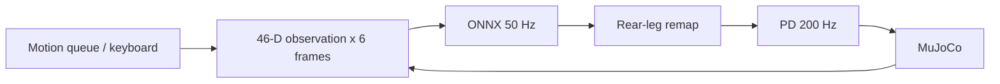
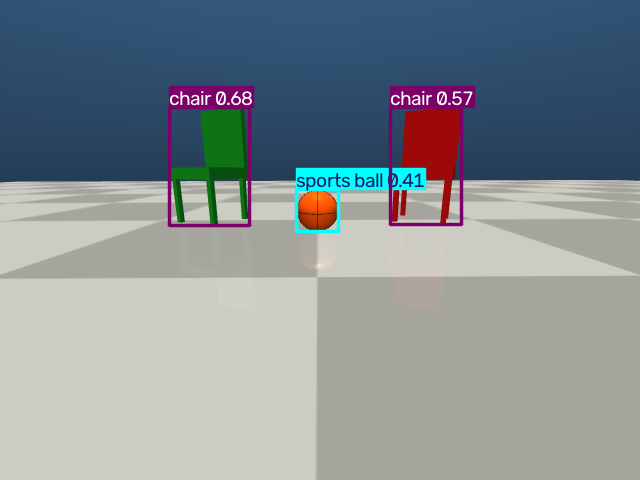

Task 2: Platform, Scene and Motion Skills

EE5112 MiniLab 1.3 | Semester 1, AY 2026/27

Contributor: Student A - [insert actual name and matriculation number]. This chapter documents Task 2 only; merge it into the group report.

2.1 Platform and control pipeline

The implementation extends the course quadruped_mujoco platform [1] at commit dd40180f1121a66373d261e64a9a09eb69b1b2a7. MuJoCo supplies dynamics; the bundled ONNX locomotion policy runs with CPUExecutionProvider. The original observation construction, rear-leg mapping, action scaling and PD torque equations are retained. A motion queue replaces the keyboard command source during autonomous skills.

Figure 2.1. The local control pipeline. Policy decisions are held for four 5 ms physics steps.

| Observation slice | Content / scale |
| --- | --- |
| 0:3; 3:6; 6:9 | Velocity command x [2,2,0.25]; body angular velocity x 0.25; projected gravity |
| 9:21; 21:33; 33:45 | Joint position deviation; joint velocity x 0.05; previous action |
| 45 | (height command - 0.25) / 0.1 |

Policy joint order is FL, FR, RL, RR, whereas MuJoCo uses FL, FR, RR, RL. Indices [0,1,2,3,4,5,9,10,11,6,7,8] reorder observations and output targets. Without this swap, rear-leg actions are applied to the opposite legs. PD uses Kp=40, Kd=1 and limits of 23.7 Nm (hip/thigh) and 35.55 Nm (calf).

---

2.2 Onboard camera and detectable scene

FrontCamera renders dog_front_camera, rigidly attached to trunk, at 640 x 480 RGB. It samples every 0.1 s of simulation time (20 physics steps). Ten Hz reduces rendering work relative to 200 Hz while providing frequent updates for object search. No wall-clock 10 Hz performance claim is made: slow rendering slows the simulation. latest() returns a locked copy with a simulation timestamp and sequence number.

The custom MJCF contains two chairs and an orange basketball. Chairs are original combinations of a seat, backrest and four legs; the ball has dark seams. External mesh downloads are unnecessary because the complete rendered shapes passed the actual COCO detector test. This does not imply that an arbitrary coloured primitive will be recognised.

Figure 2.2. YOLO11n detections from the live front camera after 2 s of simulation. CPU inference, imgsz=640, confidence threshold=0.25. The RGB array is converted to BGR before NumPy-based YOLO inference.

| Object | COCO class | Centre (x,y,z), m | Confidence |
| --- | --- | --- | --- |
| Green chair | chair | (3, 1, 0.5) | 0.678 |
| Red chair | chair | (3, -1, 0.5) | 0.571 |
| Orange basketball | sports ball | (2.5, 0, 0.16) | 0.408 |

Object centres are recorded in assets/objects.json for distance logging and evaluation only. Task 4 must consume latest() as its sole image source and infer colour from pixels; the class detector alone does not provide colour. Scene labels in this table describe authored objects, not an evaluated colour-grounding algorithm.

---

2.3 Motion API and measured turning error

move(vx, vy, wz, duration) adds a timed command to a thread-safe FIFO queue. Commands are normalised to [-1,1]; they are not guaranteed physical velocities. The control loop checks simulation time, advances the queue in order and returns zero velocity when idle. turn(angle_deg) reads the root quaternion and accumulates wrapped yaw differences, preserving turn direction through the +/-180 degree boundary and supporting turns up to +/-720 degrees.

The turn controller saturates at |wz|=0.65 and uses a minimum nonzero magnitude of 0.40 to overcome the learned gait response dead zone. It stops at an instantaneous yaw error of at most 2 degrees and logs [TURN]. A timeout clears remaining actions and reports FAIL. This is a heading skill; it does not freeze the robot pose or actively hold heading after completion.

For a fair open-loop baseline, a four-second left turn at wz=1 measured a mean rate of 0.651790 rad/s. Each open-loop duration was then |target angle| / calibrated rate. Both methods start after two seconds of settling; the table measures yaw again one second after the command ends. Each condition is one deterministic trial, not a statistical robustness study.

| Method | Target | Measured yaw | Signed error | Time, s |
| --- | --- | --- | --- | --- |
| open | 90 deg | 89.05 deg | 0.95 deg | 2.42 |
| closed | 90 deg | 85.74 deg | 4.26 deg | 5.82 |
| open | 180 deg | 181.24 deg | -1.24 deg | 4.82 |
| closed | 180 deg | 174.88 deg | 5.12 deg | 10.73 |
| open | -90 deg | -111.30 deg | 21.30 deg | 2.42 |
| closed | -90 deg | -83.44 deg | -6.56 deg | 4.68 |

The calibrated open-loop left turns were accurate (0.95 and -1.24 degrees), but reusing that timing for a right turn produced 21.30 degrees error. Direction-dependent gait dynamics invalidate a single universal timing constant. Closed-loop completion errors were 1.92, 1.89 and -1.99 degrees. After one second, errors increased to 4.26, 5.12 and -6.56 degrees because of gait relaxation. Feedback reduced the large right-turn error, but was slower and did not outperform calibrated open loop in every test.

Demo: move(0.5,0,0,3), then turn(180); recorded completion error 1.93 degrees, SUCCESS.

---

2.4 Reproduction, integration and evidence

The tested environment is Linux with Python 3.12, MuJoCo 3.14.0, ONNX Runtime 1.30.0 and Ultralytics 8.4.160. Dependency pins are in requirements-task2.txt; environment-tested.txt records the resolved environment. Install CPU Torch/Torchvision first, then install the repository editable and the Task 2 requirements. The ONNX policy and YOLO11n weights are included.

| Purpose | Command from repository root |
| --- | --- |
| Native / browser | python -m task2.run MUJOCO_GL=egl python -m task2.run --gui |
| Scene verification | MUJOCO_GL=egl python -m task2.verify_scene |
| Turn comparison | MUJOCO_GL=egl python -m task2.evaluate |
| Unit checks | python -m pytest -q task2/test_skills.py |
| Automated video | MUJOCO_GL=egl python -m task2.run --headless --demo --duration 22 --record evidence/Video_Task2.mp4 |

The original eg/play.py launched successfully in native mode and the browser service ran with --gui. API checks exercised W/S/A/D/Q/E, Race Track, Stairs and Cross Slope, and selected all three onboard cameras. Separate named-camera renders are included. The six unit tests passed, covering queue timing, cancellation, yaw wrapping/full turns, invalid inputs and timeout. Browser skill actions also completed a move and a 180-degree turn (1.87 degrees error).

Task 3 should enqueue actions from its own input/LLM thread while the main simulation thread continuously calls Platform.step(). Task 4 reads FrontCamera.latest(), rejects stale frames and issues short motion commands. Ground-truth object centres are not read by either the motion controller or the camera pipeline. Task 3/4 logic and their evaluation are outside this implementation.

Submission limitation. Video_Task2.mp4 is an offscreen simulation recording with synchronised console text, not a desktop terminal recording. To meet the literal terminal-visible requirement, record the browser/native window beside a terminal, trigger M then K, and retain the [TURN] SUCCESS line. The supplied evidence does not claim that the student has personally performed that recording.

AI Usage Declaration (review before submission). OpenAI Codex assisted with implementation, scene construction, debugging, test execution and drafting this Task 2 chapter. The submitting student must review the code, fill in their identity and actual contribution, and be able to explain the submitted work.

References

[1] Course platform: https://github.com/aoqianz/quadruped_mujoco (commit recorded on page 1). [2] MuJoCo documentation: https://mujoco.readthedocs.io/ [3] Ultralytics documentation and YOLO11n COCO weights: https://docs.ultralytics.com/ [4] EE5112 MiniLab 1.3, Semester 1 AY2026/27, Task 2 specification.

See evidence/turn_comparison.csv and evidence/detections.json for numerical tables.
